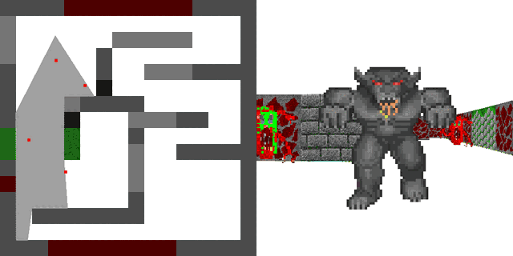

# tinyraycaster (my version)

A small CPU raycaster in C++ with SDL3. Renders a textured maze in first person with sprite monsters and a per-pixel depth buffer, alongside a top-down view of the same map.



## About

Inspired by [ssloy's tinyraycaster](https://github.com/ssloy/tinyraycaster).

I didn't copy the code. I read the lessons first, took notes, then wrote the whole thing from scratch using only those notes. So the structure and naming are my own.

## Controls

| Key | Action |
|---|---|
| `W` / `S` | Walk forward / back |
| `A` / `D` | Turn left / right |
| `Esc` | Quit |

## Build & Run

```bash
clang++ main.cpp framebuffer.cpp map.cpp utils.cpp renderer.cpp texture.cpp -I. -ISDL3 -Llib/x64 -lSDL3 -o main.exe
```

Copy `lib/x64/SDL3.dll` next to `main.exe`, then run it.

## Files

| File | What it does |
|---|---|
| `main.cpp` | SDL window, input, movement, frame loop |
| `renderer.cpp` | Ray marching, wall projection, sprite billboards, depth testing |
| `framebuffer.h` | Colour buffer and float depth buffer |
| `map.cpp` | The grid of wall cells |
| `texture.cpp` | Loads packed texture sheets, scales wall columns |
| `utils.cpp` | Colour packing, PPM output |
| `player.h` / `sprite.h` | Camera and billboard state |

## Notes

- Window is 1024x512: top-down map on the left half, first-person view on the right.
- The level is hardcoded in `map.cpp`; edit `mapData` to change it. Sprites are hardcoded in `main()`, in map grid coordinates.
- Walls are found by marching each ray in 0.01 steps, then projecting `height / distance` with a `cos` correction so the view is not fisheyed.
- Sprites test against a float depth buffer, so they occlude correctly against walls and each other without needing to be sorted.
